# Scanned exams in Aldoc to Canvas

## Topics

* Starting the application
* Ensure correct user role
* LADOK Aktivitetstillfälle UUID
* Setup course room
* Setup assignment to hold submissions
* Importing scanned exams from Aldoc
* Notes


## Starting the application

The application is designed as an LTI Application to be started from the course navigation. Canvas connects to the launch url
with OAuth data and after the OAuth token exchange the course context is provided to the app. A start screen is displayed and
after pressing the button the app launches.

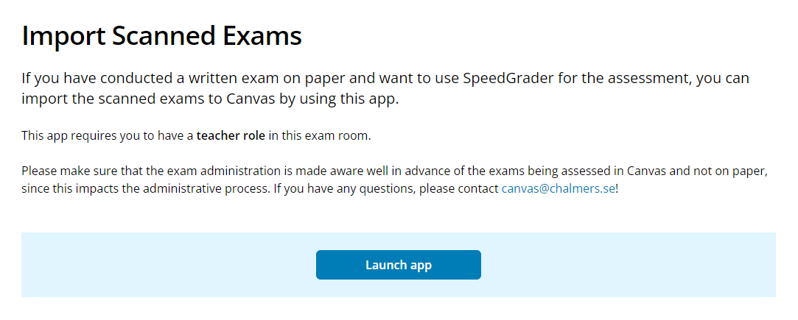


## Ensure correct user role

The user running the app must have at least a Teacher role in the course. If not, an error message will be displayed.

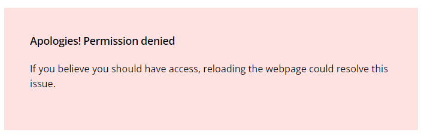


## LADOK Aktivitetstillfälle UUID

In the course there must be at least one section that matches a "LADOK Aktivitetstillfälle UUID" for the exam. At Chalmers,
this is handled when setting up the exam course and sections are created matching the LADOK information.

The application tries to match LADOK UUID in the Section's SIS ID using the regex in the environment variable ```CANVAS_SECTION_LADOKID_REGEX```.

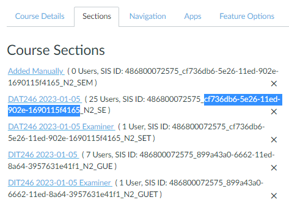

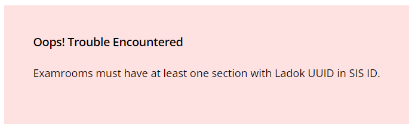

If the application can't find any relevant sections, there is an error message. If this happens, contact an administrator
for more help on resolving the issue.


## Setup the course room

At Chalmers, we already setup our course rooms in a standard way when creating them in advance for the exams. You can go
ahead and skip this step, the "Use recommended homepage" button is disabled. 

The next step is to publish the exam room, so students can access it.

If the exam room is already published, you will not see the exam room steps and the app will skip ahead to the Assignment setup.

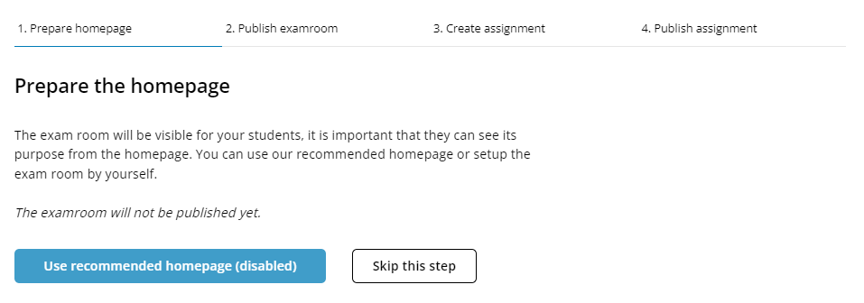

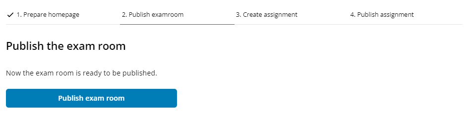


## Setup assignment

An assignment needs to be created to hold the imported scanned exams as submissions for each student. The application will look
in Aldoc data to see if there are "anonymous code" on each file for the exam and then create the assignment with the option
"anonymous grading".

After creating the assignment, you can go back to Canvas and edit the assignment as you need. For example, you might want to
adjust the max score and grading type, and add a Rubric. 

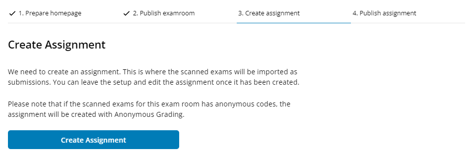

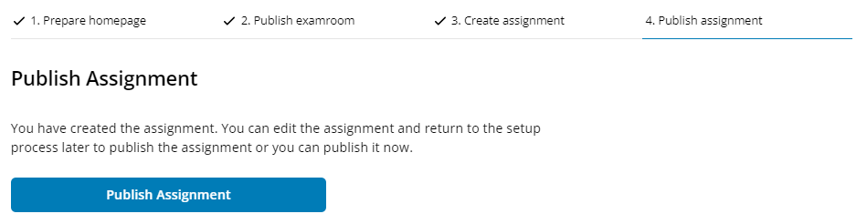

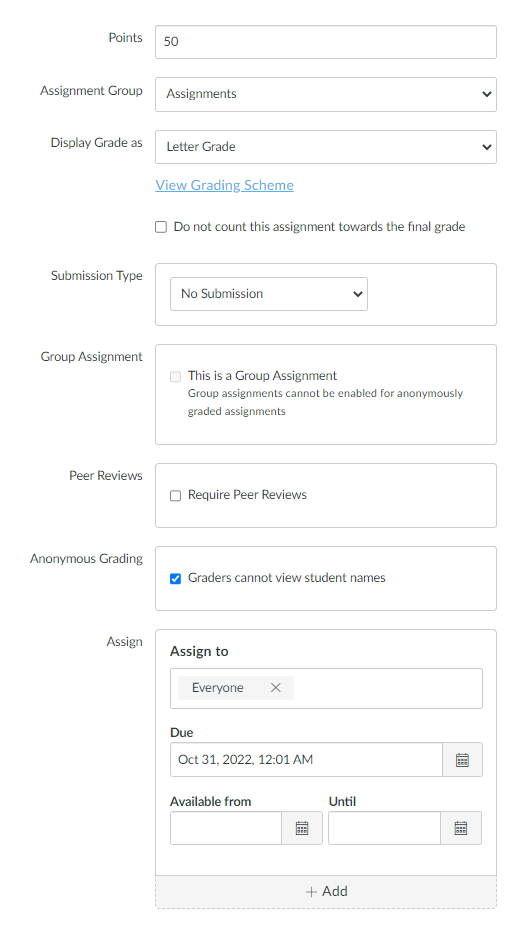


## Importing scanned exams from Aldoc

When the setup is ready, the application will display how many files/exams were found in Aldoc. Click "Start import" to download
them and add as submissions to the created assignment.

When the import process is ready, a result view is displayed and hopefully everything went ok. Go ahead and press "Go to Assignment",
or navigate to it the standard Canvas way.

Note: If there are errors, they will be displayed under "Resolve Issues". It can be a number of problems, ranging from students not found
in exam room to unable to match or data missing. Please contact a Canvas administrator if this happens.

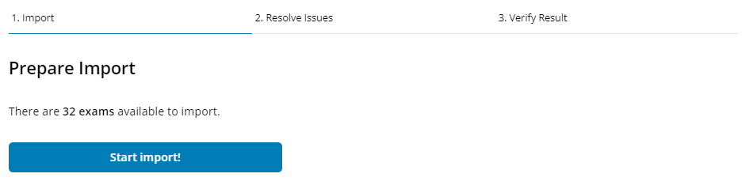

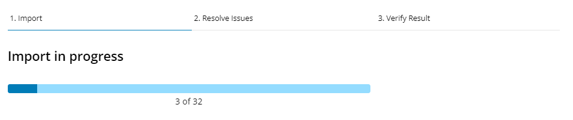


## Notes

### Application remembers where you were

If you exit the application to do other work in Canvas, for example edit the assignment or check the student rooster, it will always
remember where you were in the process and return there. For example, if you are done with the setup process and are ready to import
the exams, it will return you to the import screen next time you click the course navigation link.

